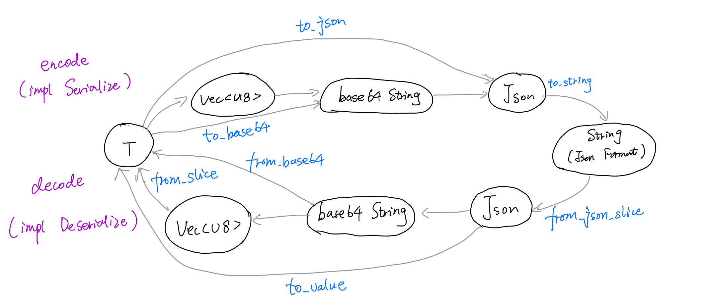

# `serde_tran`: helper to encode/decode your JSON data

## Background
When we use the HTTP protocol (or other transmission protocols),
it is convenient and common to use the Json data format to store
it in the HTTP request body or response body.

However, when we transmit a large amount of data (for example,
a large array, and the key in the Map type data is relatively
long), it is not efficient to use Json data directly.

Therefore, you can consider using this library. This library will
help you encapsulate Json type data (that is, `impl Serialize`)
with an extra layer (the result is still Json, but the data is more compact).

## Usage

First, we define a struct in our example, which `impl Serialize`:

```rust
use serde::{Serialize, Deserialize};

#[derive(Serialize, Deserialize)]
pub struct MyStruct {
    // fields...    
}
```

```rust
pub fn example() {
    let s = MyStruct {};
    
    // 1. convert it to serde_tran::Json
    let json = serde_tran::to_json(&s).unwrap();
    
    // json is something like: {"f": "base64", "v": "(base64 encoded string)"}
    // you can use json.to_string() to get the json string.
    
    // 2. convert it back to MyStruct
    let ds: MyStruct = json.to_value().unwrap();
    
    assert_eq!(s, ds); // they are the same (remember to derive PartialEq to use macro assert_eq!)
}
```

More examples, see the folder `examples`.

## How it works

This picture shows all the public function from `serde_tran`:


 
## Features

+ `serde_json (default)`: enable `Json`. If you use `serde_json`, `base58` or `base64` must be enabled (at least one).
+ `base64 (default)`: enable base64 encoding, using crate (base64)[https://docs.rs/base64/latest/base64].
+ `bs58`: enable base58 encoding, using crate (bs58)[https://docs.rs/bs58]. Warning: this encoding is slow.

## Wasm
use `wasm` in your web client.

> Work in progress

## Benchmark
> todo()
